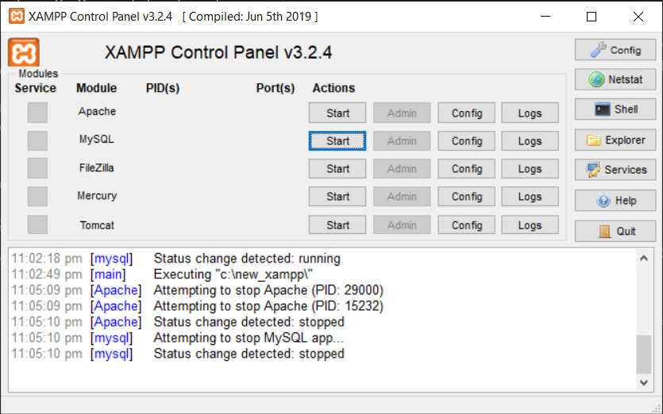

# Google PageSpeed Dashboard

## About (The spark that started the project ... )
* A simple dashboard for user to key in the respective URLs they would like to query for. Once ready, the application will send the URLs to Google's server, compute them and retrieve the results based on the inserted keys for the API.

## Acknowledgements
1. Google's Community - Thankful for the contribution in building the PageSpeed insights API and sharing it with the public where enthusiats could leverage on the tool's strength and build something more powerful with other features.

## Technologies
1. _HTML/5_
1. _CSS/3_
1. _JavaScript ES5/6_
1. _Bootstrap v5 & Icons v1.5.0_
1. _[Google Pagespeed Insights API v5](https://developers.google.com/speed/docs/insights/v5/get-started)_

## Future Plans
1. Perform validations on the URL textfield(s) before the 'Run' program execution can be run.
1. Retrieve results for both **"DESKTOP"** and **"MOBILE"** category platform. Currently, the results represents ' MOBILE ' category only.

## Installation
1. Clone the project from Github - from your command line terminal
    ```
    git clone https://github.com/naturalDev0/google-pagespeed-db.git
    ```


2. Paste it inside an Plug-n-play local server (i.e., XAMPP, WAMP, MAMP)
<br>( The following example is for Windows PC )

    

    ```
    c:/xampp/htdocs/<folder-name-of-google-dashboard>/<files-location-to-paste-in>
    ```


3. Navigate to the URL on your localhost


4. Enjoy the application!